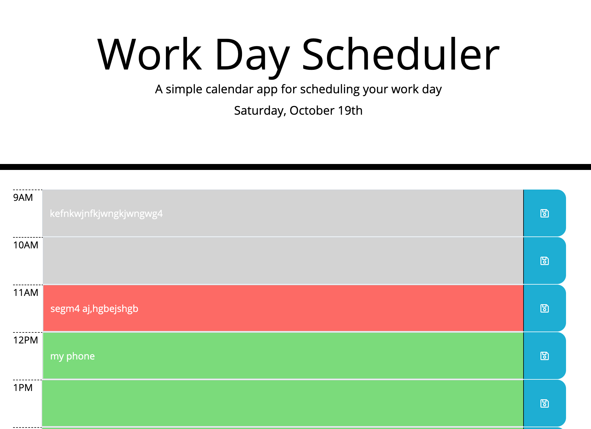

# Work Day Scheduler

 

In the UCLA Coding Bootcamp students were challenged with creating a scheduler application that would be responsive, color dynamic, and that saved the user responses once the save buttons were clicked. Students were only allowed to use HTML, CSS and Javascript.

In order to begin this activity, I started with the following pseudocode. 

HTML: 
- Page contains typical HTML elements (header, body, h1 etc.)
- Page contains buttons and inputs

CSS: 
- Current work day is on the top of the application
- All hours from 9AM to 5PM are on the left side of the screen
- Comment box for each hour is in the middle of the screen
- Buttons are all on the right side of the screen 

Javascript: 
- Upon clicking save, user notes are saved to local storage within the same comment box
- If hour is past, dynamically change css of comment box to grey
- If hour is present, dynamically change css of comment box to red
- if hour is future, dynamically change css of comment box to green

Below are examples of the application. 

 

